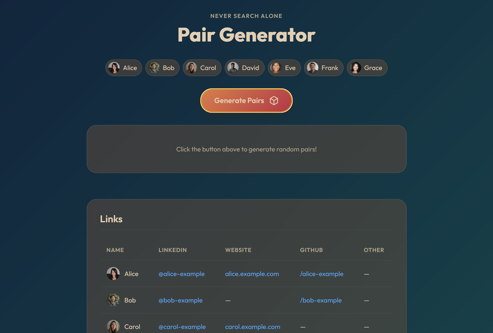

# JSC  Pair Generator

A lightweight browser tool for randomly pairing Job Search Council group members for sessions. Click the chips to select or deselect members, hit the button, and get your pairs.



➡️ [View Demonstration](https://datatimp.github.io/jsc-pair-generator)

## What it does

- Randomly shuffles members and assigns them into pairs
- Handles an odd number by forming one group of 3
- Displays each member's photo alongside their name (falls back to initials if no photo is provided)
- Shows a shared links reference table from a Markdown file

## Setup

1. Click **Use this template → Create a new repository** (green button at the top of this page) to create your own copy
2. Enable GitHub Pages: go to your new repo's **Settings → Pages**, set source to the `main` branch and `/ (root)`, and save
3. Edit `assets/docs/members.md` with your group's names
4. Edit `assets/docs/links.md` with your group's links
5. Optionally add member photos to `assets/images/members/` (see below)
6. Commit and push — GitHub Pages will rebuild automatically and your site will be live at `https://<your-username>.github.io/<repo-name>/`

> **Note:** The app uses `fetch()` to load member and links data, so it must be served over HTTP — it will not work if you open `index.html` directly as a local file. GitHub Pages handles this for you.

## Project structure

```
├── index.html
├── app.js
├── styles.css
└── assets/
    ├── images/
    │   ├── members/    # Member photos (optional)
    │   └── public/     # Public assets (e.g. screenshot)
    └── docs/
        ├── members.md  # List of member names — edit this
        └── links.md    # Member links table — edit this
```

## Adding or updating members

Edit [`assets/docs/members.md`](assets/docs/members.md) — one name per line as a bullet:

```markdown
# Members

- Alice
- Bob
- Carol
```

## Adding photos

Drop a photo named after the member (lowercase) into `assets/images/members/`. Both `.jpg` and `.png` are supported:

```
assets/images/members/alice.jpg
assets/images/members/bob.png
```

Members without a photo will show their initial instead.

## Adding links

Edit [`assets/docs/links.md`](assets/docs/links.md). Each member is a block of key/value pairs separated by a blank line. Leave a field empty if not applicable:

```
Name: Alice
LinkedIn: [@alice](https://www.linkedin.com/in/alice/)
Website: [alice.com](https://alice.com)
Github: [/alice](https://github.com/alice)
Other:
```

The table is sorted alphabetically by name on load.

## Misc.

This tool was written to be used by Job Search Councils, an accountability job-search group set up under [Never Search Alone](https://www.neversearchalone.org), a non-profit organization. Visit Never Search Alone for more information or if you would like to join a JSC.
